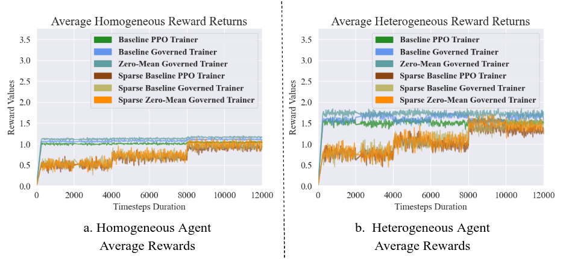

### Boosted Social Dilemma Collusion

This repository provides a compact multi-agent implementation for the social dilemma problem with homogenous and heterogenous agents having same and different reward pay-offs respectively.
This `N`-player social dilemma problem simulates cooperation amongst agents, and we further use governance kernels to supercharge this cooperative collusion with governance kernels.
The social dilemma environment is implemented with the `PettingZoo` package, and the PPO reinforcement learning algorithm is supported through Ray's `rllib` multi-agent CTDE implementation.

#### Detailed Functional Description

First, the founding action strategy pay-off matrix/vector is defined by the `collusion_payoffs.py` module. This allows the functionality to add more agents _(num\_agent)_, and also introduce heterogeneity _(hetero\_prob)_ as well.
The `collusion_dilemma_envs.py` implements the collusion dilemma environments in both _ParallelEnv_ and _AECEnv_ formats _(refer `PettingZoo` documentation)_.
And, in addition to _num\_agent_ and _hetero\_prob_ parameters, this environment also supports the episode length with `eps_len` to customize the episode length.
Finally, we have our `ppo_agent_trainer.py` script which trains the agent with CTDE PPO for the social dilemma problem’s POSG setting.
And, we carry out our experiments multiple times to plot the confidence intervals as well.
It quantifies the variations in the learning curve with added noise of 20 % in payoff values.
The noise parameter was further added to check the robustness of the learning algorithms against the reward noise.

#### Getting with the Project Implementation

For setting the repository please follow the below listed steps to begin your easy experimentation with this codebase.

* First, add the project repository to your `PYTHONPATH` or add it to your virtual environment’s `.pth` file
* Make sure prerequisite packages are installed for avoiding any package dependency issues. A helpful `requirements.txt` from `pip freeze` command is added as reference.
  - `Known Issue Fix`: Because of some implementation compatibility issues between `PettingZoo` and `rllib`, the `pettinzoo_env.py` wrapper file in `rllib` needs to be updated. Please, remove the `return_info=True,` occurrences from this file for successful execution of the trainer scripts.

After the setup, the model can be simply trained with the execution of the main trainer script `ppo_agent_trainer.py`.
Additionally, customization to agent nature, agent numbers, and other hyperparameters can be done through changing the imported config `.yaml` files.
Further, governance kernels can be added to train the reward shaped governed agents as well.

__Note:__ Installing this setup can cause some unexpected issues. Please, feel free to report any dependency related new issues.

#### Initial Results and Discussion

In below plots, first we visualize the expected reward returns in a sixteen agent social dilemma problem where each agent has binary action space.
But, for homogeneous agents all agents have the same reward value, but in heterogeneous settings 50 % of agents will get higher rewards in cooperation.
Additionally, we also add some noise in all the reward payoffs to measure the robustness of the learning algorithms as well.

<p align="center">
  
</p>
<p align="center">
<b>Figure 1:</b> Expected total reward distribution plots for an episode with homogeneous and heterogeneous agent settings
</p>

From Figure 1, we observe that governed kernels do not affect the maximum expected reward distribution in all the stated settings. 
Hence, the added PBRS factor the maximum gains corresponding to each agent are affected to a great extent during an episode.
But, since governance kernels adds rewards for all the joint action possibilities therefore we can possibly observe change in the learning behavior of the agents on an average.

<p align="center">
  
</p>
<p align="center">
<b>Figure 2:</b> Governed and baseline average reward returns for an agent in homogeneous and heterogeneous setups
</p>

From Figure 2, we observe that learning behavior of the agents on an average in homogenous settings is almost identical convergence for all approaches, and governed agents accumulate relatively higher rewards on an average.
But, it can possibly be attributed to additional reward signals provided with the governance kernels.
Whereas in a heterogeneous setting, we observe that zero-mean kernels does help in gaining additional performance gains with respect to the baseline approach.
And, the policy for only positive reward kernels overfits and oscillates between the baseline and zero-mean kernel policies during the learning stage.
Therefore, in heterogeneous settings the governance kernels are effective in achieving performance gains in a relatively larger agent setting.

#### Citing the Experiment Findings and Accompanying Theoretical Document

If you find the experimentation work interesting and useful for your work, please consider citing it with:

```
@misc{algorithmic-collusion-analysis,
  author = {XXXX, XXXXXX},
  title = {XXXX XXXX XXXX XXXX XXXX},
  year = {XXXX},
  publisher = {GitHub},
  journal = {GitHub repository},
  howpublished = {XXX.XXX.XXX},
}
```

